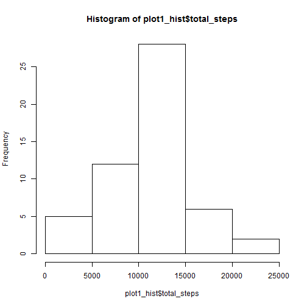
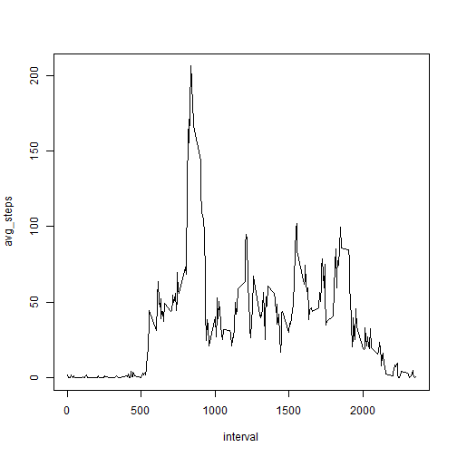
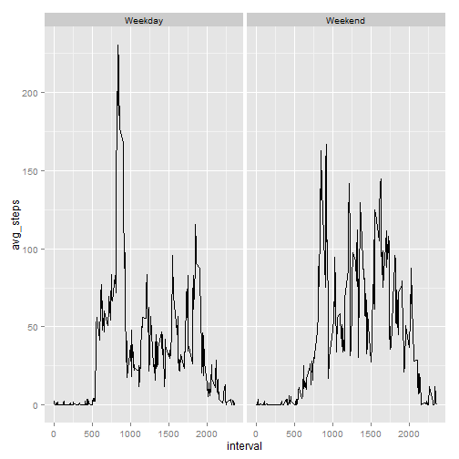

This is an R Markdown document. Markdown is a simple formatting syntax for authoring HTML, PDF, and MS Word documents. For more details on using R Markdown see <http://rmarkdown.rstudio.com>.

When you click the **Knit** button a document will be generated that includes both content as well as the output of any embedded R code chunks within the document. You can embed an R code chunk like this:

## Set Working Directory

```r
echo=TRUE
setwd("C:/Users/jbkessin/Documents/Repr_Research/PA1")
```
## Read Data in

```r
echo=TRUE
activity <- read.csv("C:/Users/jbkessin/Documents/Repr_Research/PA1/activity.csv",)
```

## Clean and format data

```r
echo=TRUE
activity <- na.omit(activity) # Removes NAs
activity$date <- as.Date(activity$date, format = "%Y-%m-%d" )
activity$day <- weekdays(activity$date)
```

## Load Dplyr
### Dplyr is a helpful package for computing summaries

```r
echo=TRUE
library(dplyr)
```

```
## Warning: package 'dplyr' was built under R version 3.2.1
```

```
## 
## Attaching package: 'dplyr'
## 
## The following objects are masked from 'package:stats':
## 
##     filter, lag
## 
## The following objects are masked from 'package:base':
## 
##     intersect, setdiff, setequal, union
```

## Aggregate data for first plot

```r
echo=TRUE
plot1_hist <- activity %>% group_by(date) %>% summarize(sum(steps))
names(plot1_hist)[2] <- 'total_steps'
```

## Histogram of Total Steps Per Day

```r
echo=TRUE
hist(plot1_hist$total_steps)
```

 

## Mean Steps Per Day

```r
echo=TRUE
mean(plot1_hist$total_steps)
```

```
## [1] 10766.19
```

## Median Steps Per Day

```r
echo=TRUE
median(plot1_hist$total_steps)
```

```
## [1] 10765
```

## Prepare Plot 2 Data

```r
echo=TRUE
plot2_ts <- activity %>% group_by(interval) %>% summarize(mean(steps))
names(plot2_ts)[2] <- 'avg_steps'
```

## Average Daily Activity Pattern

```r
echo=TRUE
plot(plot2_ts, type="l")
```

 

## The Interval with the Highest Average

```r
echo=TRUE
answer <- arrange(plot2_ts, desc(avg_steps))
answer[1,1]
```

```
## Source: local data frame [1 x 1]
## 
##   interval
## 1      835
```

## Total Number of Missing Values

```r
echo=TRUE
na_activity <- read.csv("C:/Users/jbkessin/Documents/Repr_Research/PA1/activity.csv",)
na_activity <- filter(na_activity, is.na(steps))
nrow(na_activity)
```

```
## [1] 2304
```

## Imput Values for NAs

```r
echo=TRUE
### Join to dataset with average steps per interval
na_act_fix <- left_join(na_activity, plot2_ts, by = "interval")
### Mutate NA Steps to be that of the average across days for that interval
na_act_fix <- mutate(na_act_fix, steps = avg_steps)
```

##Create a Dataset with All Values, including what was originall NA

```r
echo=TRUE
na_act_fix <- na_act_fix[,1:3]
na_act_fix$date <- as.Date(na_act_fix$date, format = "%Y-%m-%d" )
activity1 <- activity[,1:3]
activity1$steps <- as.numeric(activity1$steps)
### Create Dataset with all values
total_activity <- union(na_act_fix, activity1)
```

## Histrogram with All Values

```r
echo=TRUE
### Prep Data
plot3_hist <- total_activity %>% group_by(date) %>% summarize(sum(steps))
names(plot3_hist)[2] <- 'total_steps'
### Plot data
hist(plot3_hist$total_steps)
```

 

## Mean Steps Per Day with All Info

```r
echo=TRUE
mean(plot3_hist$total_steps)
```

```
## [1] 10766.19
```

## Median Steps Per Day with All Info

```r
echo=TRUE
median(plot3_hist$total_steps)
```

```
## [1] 10766.19
```

### Analysis shows that Imputing missing data had very little impact to mean and median.  Mean remained the same and median changed slightly.  New data has exact same mean and median.

## Prep Data for Weekend Analysis

```r
echo=TRUE
### Put data together
total_act_1 <- total_activity
total_act_1 <- mutate(total_act_1, Day_Type = 
  ifelse(weekdays(total_act_1$date, abbreviate = FALSE ) %in% c('Saturday','Sunday'), 'Weekend', 'Weekday') )
total_act_1$Day_Type <- as.factor(total_act_1$Day_Type)
final_plot <- total_act_1 %>% group_by(interval, Day_Type) %>% summarize(mean(steps))
names(final_plot)[3] <- 'avg_steps'
```
## Plot Data to Analyze Steps on Weekends vs Weekdays

```r
echo=TRUE
library(ggplot2)
```

```
## Warning: package 'ggplot2' was built under R version 3.2.2
```

```r
ggplot(final_plot, aes(x=interval, y=avg_steps)) + geom_line() + facet_grid(. ~ Day_Type) +
facet_wrap(~Day_Type) 
```

 
